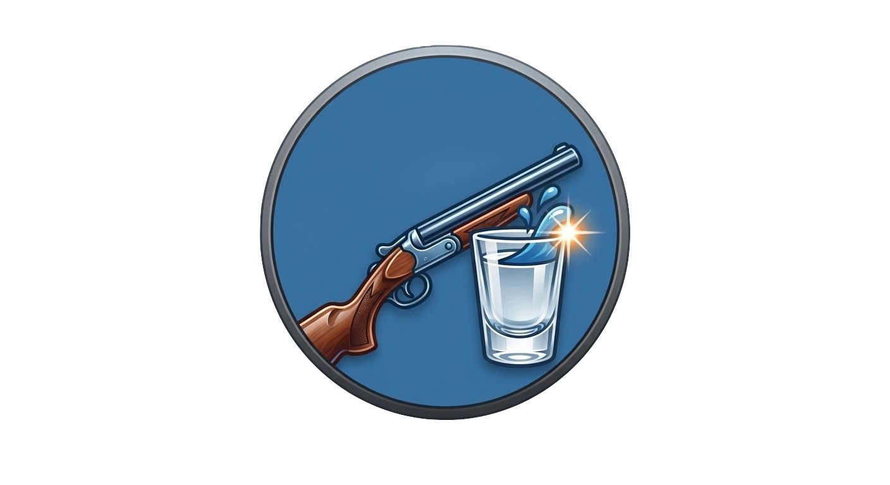

<p align="center">
  
</p>

# Shotty

A lightweight macOS screenshot and annotation tool that lives in the menu bar.

## Features

- **Three capture modes**
  - Full screen
  - Window picker — click any visible window to capture it
  - Area selection — drag a rubber-band rect across any region
- **Annotation tools**
  - Pen — freehand drawing with configurable colour and stroke size
  - Eraser
  - Text — click anywhere on the canvas to place a text label
  - Emoji stickers — choose from a built-in emoji grid
- **Copy to clipboard** — button or `⌘C`
- **Save as PNG** — with a timestamped default filename
- **Undo** — `⌘Z` or toolbar button
- **Global hotkey** — `Ctrl+Shift+S` triggers area selection from anywhere
- Menu bar agent — no Dock icon, no Dock bounce

## Requirements

- macOS 14 Sonoma or later (tested on macOS 26 Tahoe beta)
- Xcode 15+ or Swift 5.10+ command-line tools
- Screen Recording permission (granted on first capture)

## Building

```bash
git clone https://github.com/squeaky-godzilla/shotty.git
cd shotty
./build.sh
open Shotty.app
```

`build.sh` compiles the release binary, copies it into the app bundle along with the icon and Info.plist, and ad-hoc signs the result.

On the first capture attempt, macOS will show a **Screen Recording** consent sheet. Click **Allow**. Subsequent captures are silent.

## Project structure

```
Shotty/Sources/
├── App/
│   ├── main.swift                        # Entry point
│   ├── AppDelegate.swift                 # Menu bar, global hotkey
│   └── Resources/
│       ├── Info.plist                    # Bundle metadata
│       └── AppIcon.icns                  # App icon
├── Capture/
│   ├── CaptureMode.swift                 # Enum: fullScreen / window / selection
│   ├── CaptureCoordinator.swift          # Orchestrates capture → editor flow
│   ├── SelectionOverlayController.swift  # Rubber-band area selection overlay
│   └── WindowPickerOverlayController.swift # Click-to-pick window overlay
└── Annotation/
    ├── AnnotationModels.swift            # Data model + undo stack
    ├── AnnotationCanvasView.swift        # Drawing canvas (NSView)
    ├── AnnotationEditorViewController.swift # Toolbar + scroll view
    └── UI/
        └── EmojiPickerViewController.swift  # Emoji grid popover
```

## Architecture notes

- Pure **AppKit** — no SwiftUI
- **Swift Package Manager** — no Xcode project file required to build
- Capture uses **ScreenCaptureKit** (`SCScreenshotManager`) — the only API that correctly composites all windows on macOS 15+
- `LSUIElement = true` — runs as a menu bar agent with no Dock presence
- Global hotkey registered via **Carbon** `RegisterEventHotKey`
- The app bundle must be **ad-hoc signed** (or Developer ID signed) for the TCC Screen Recording grant to persist across launches

## License

MIT
